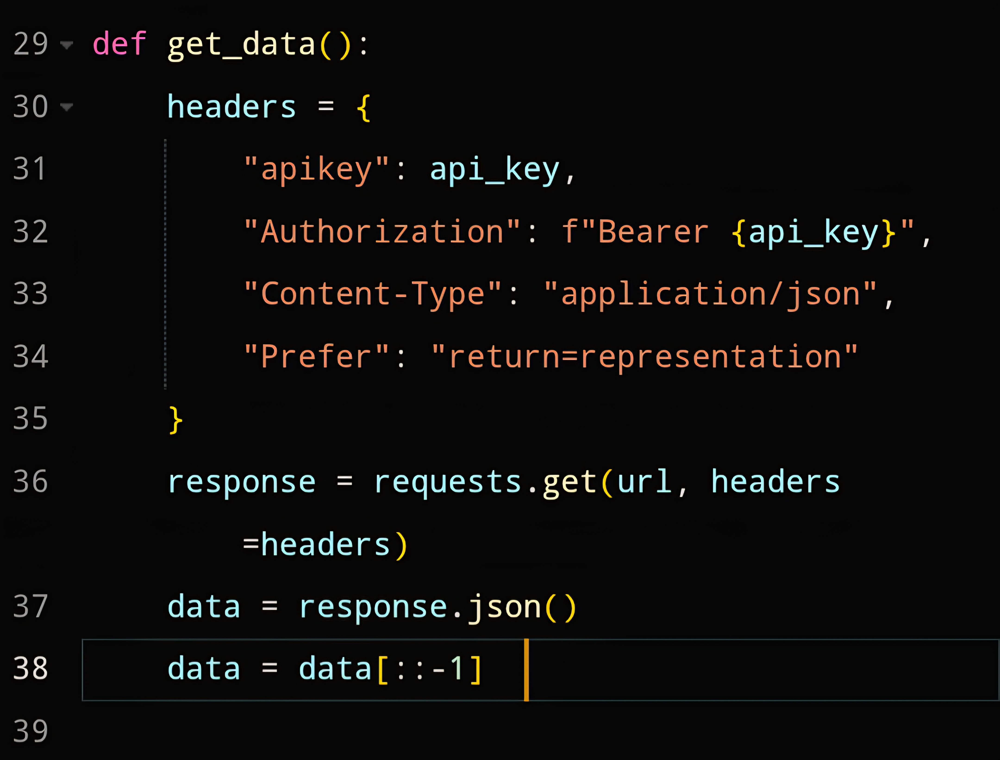

# WashMobile

تطبيق ويب (PWA) لحجز مواعيد غسيل السيارات، سواء لخدمة الغسيل المتنقل أو داخل المحل.  

## المزايا
- يسهل على المستخدم طلب الخدمة.  
- يعرض الخدمات وأسعارها بشكل مباشر دون الحاجة للسؤال.  
- يوفر لصاحب الخدمة جدولًا لعرض معلومات الطلبات القادمة.  
- يحتوي على لوحة متابعة ودراسة وتحليل الخدمات.  

## طريقة العمل
- مبني باستخدام **Flask**.  
- يعتمد على قاعدة بيانات **Supabase**.  
- الاتصال يتم عبر **Requests** وليس عبر مكتبة رسمية لـ Supabase.  

  
## هيكل المشروع 
```bash
project-vage/
|__main.py
|__static/
|    |__icons/
|    |  |__ico_1.png
|    |  |__ico_.png
|    |__images/
|    |__style.css
|    |__about.css
|    |__home.css
|    |__add.css
|    |__main.js
|    |__manifest.json
|    |__robots.txt
|    |__sitemap.xml
|__templates/
|    |__home.html
|    |__add.html
|    |__about.html
|    |__work.html
|    |__login.html
|    |__footer.html 
|    |__admin.html
|__data.py
|__delay.py
|__vage.py
|__requirements.txt
|__service-worker.js
|__vercel.json
```
## التثبيت
1. انسخ المستودع:
```bash
git clone https://github.com/lahrour88/project-vage.git
cd project-vage
```
2. تثبيت المتطلبات :
```bash
pip install -r requirements.txt
```
## الاستخدام :
3. شغل التطبيق :
```bash
    python main.py
```
4. افتح المتصفح على الرابط :
```bash
http://localhost:5000
```
